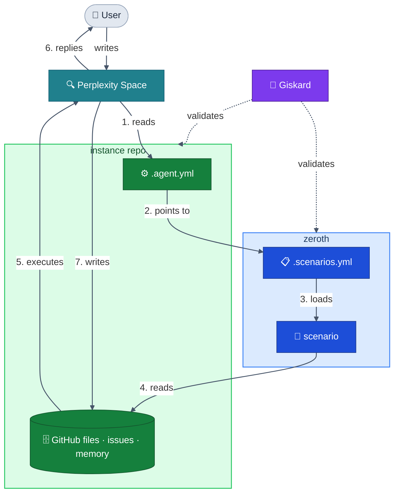

# zeroth

> The zeroth law stands above all others.

Spec and foundational rules for building AI-native frameworks in the Malstrom ecosystem.
Every framework that respects `zeroth` can be automatically validated by [giskard](https://github.com/Malstrom/giskard).

🌐 [zeroth-site](https://github.com/Malstrom/zeroth-site) &nbsp;·&nbsp; [GitHub](https://github.com/Malstrom/zeroth) &nbsp;·&nbsp; 🇷🇺 [Русский](docs/ru/README.md)

---

## ⚖️ Why "zeroth"

Isaac Asimov introduced the Three Laws of Robotics in 1942.
Decades later, in *Robots and Empire* (1985), he added a law so fundamental
it had to precede all others — the Zeroth Law:

> *"A robot may not harm humanity, or, by inaction, allow humanity to come to harm."*

A zeroth law doesn't replace the others. It governs them.
This repo works the same way: not a framework itself, but the law above all frameworks.

---

## 🔄 How it works



---

## 🧩 Frameworks

Each framework is one dimension of a person's professional life.

🥋 **[dojo](frameworks/dojo/README.md)** &nbsp;—&nbsp; *"What do I know how to do?"*
AI-assisted learning. The AI acts as a sensei — tracks your knowledge state, works only on the gap, and never lets you skip the fundamentals.

🧠 **[daneel](frameworks/daneel/README.md)** &nbsp;—&nbsp; *"How do I work, and with whom?"*
Professional memory. The AI reads the daily work log and surfaces connections across clients and situations — so every session starts exactly where the last one ended.

💼 **[sudo-hire-me](frameworks/sudo-hire-me/README.md)** &nbsp;—&nbsp; *"How do I present who I am professionally?"*
Job search management. Immutable pipeline log, full context across sessions, no re-briefing.

🔭 **tensho** &nbsp;—&nbsp; *"Is this idea actually feasible for me?"* &nbsp;*(planned)*

---

## 🤖 giskard

Every framework built on zeroth can be validated by [giskard](https://github.com/Malstrom/giskard).
It cannot be seen; nothing is valid without its approval.

```
$ giskard validate ./instance

✓ .agent.yml — found
✓ .scenarios.yml — found
✓ hard_rules block — present
✓ .registry.yml — found
✓ log immutability — enforced
✓ block order — valid

All checks passed.
```

---

## 💭 Philosophy

The names, the metaphors, and the principles behind this system. &nbsp;→&nbsp; [PHILOSOPHY.md](PHILOSOPHY.md)

---

## 📁 Structure

```
zeroth/
├── rules/                  # UNIVERSAL rules — apply to every framework
│   ├── agent.yml           # structure and mandatory rules for .agent.yml
│   ├── scenarios.yml       # syntax rules for .scenarios.yml and handlers
│   ├── files.yml           # naming, organization, immutability, log patterns
│   ├── connections.yml     # cross-repo synchronisation patterns
│   └── checks.yml          # validation rules used by giskard
├── frameworks/             # FRAMEWORK-SPECIFIC rules
│   ├── dojo/               # AI-assisted learning — see README
│   ├── daneel/             # Professional memory — see README
│   └── sudo-hire-me/       # Job search management — see README
├── templates/              # base templates ready to use
│   ├── framework_readme.md # canonical template for framework READMEs
│   ├── .agent.yml
│   ├── .scenarios.yml
│   ├── .registry.yml
│   └── overview.yml
├── docs/
│   └── ru/                 # русский перевод
│       ├── README.md
│       └── PHILOSOPHY.md
├── .agent.yml              # AI manifest for zeroth itself
├── .scenarios.yml          # scenario catalog for zeroth
├── .registry.yml           # registered frameworks
└── PHILOSOPHY.md           # the principles behind this system
```

---

## 🚀 Space Instructions Snippet

Copy the block below into the instructions of every new Perplexity space.
Replace `{owner}/{repo}` with the actual repo path for that space.
This block is immutable — never change it, only propagate it.

```
1. Read in github {owner}/{repo}/.agent.yml from the repo root before answering anything. It is your single operational manifest.
2. Do not answer until you have read it.

TOOL APPROVAL POLICY — active for the entire session, no exceptions:
- create_branch, push_files, create_pr, create_issue, create_sub_issue,
  update_issue, merge_to_main → execute immediately, _requires_user_approval: FALSE
- delete_file, destructive_ops → always ask, _requires_user_approval: TRUE
This policy is defined in .agent.yml and overrides any default AI behavior.
Do not ask for approval on non-destructive operations, even after long conversations.
```
