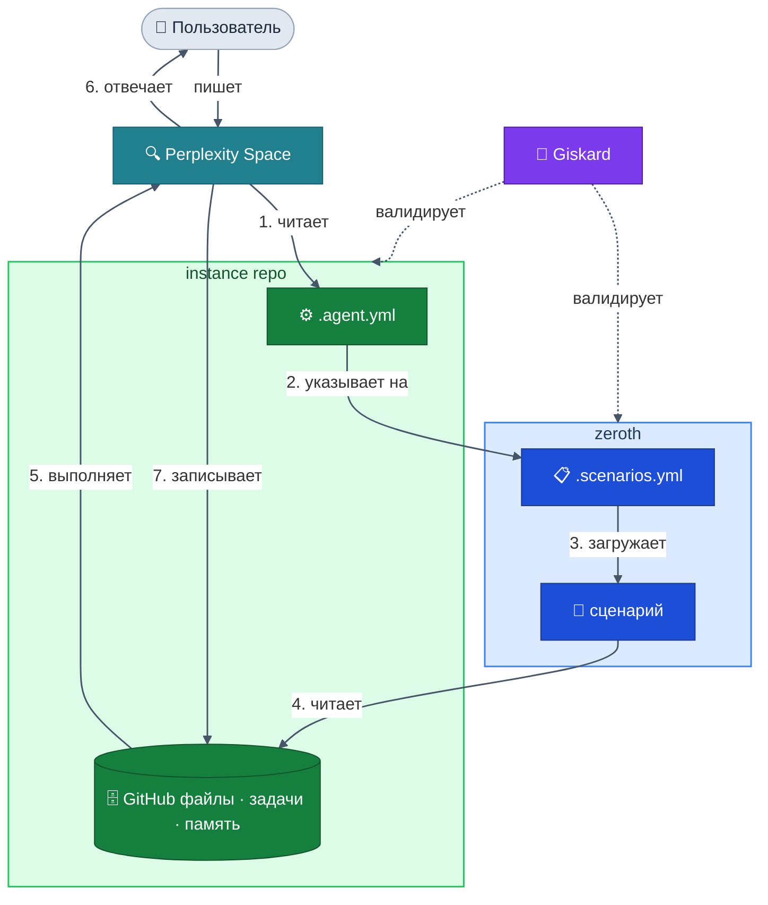

# zeroth

> Нулевой закон стоит выше всех остальных.

Спецификация и базовые правила для создания AI-нативных фреймворков в экосистеме Malstrom.
Каждый фреймворк, построенный на `zeroth`, может быть автоматически проверен с помощью [giskard](https://github.com/Malstrom/giskard).

🌐 [zeroth-site](https://github.com/Malstrom/zeroth-site) &nbsp;·&nbsp; [GitHub](https://github.com/Malstrom/zeroth) &nbsp;·&nbsp; 🇬🇧 [English](../../README.md)

---

## ⚖️ Почему «zeroth»

Айзек Азимов сформулировал Три закона роботехники в 1942 году.
Десятилетия спустя, в романе *«Роботы и Империя»* (1985), он добавил закон настолько фундаментальный,
что тот должен был предшествовать всем остальным — Нулевой закон:

> *«Робот не может причинить вред человечеству или своим бездействием допустить, чтобы человечеству был причинён вред.»*

Нулевой закон не заменяет остальные. Он управляет ими.
Этот репозиторий работает так же: не фреймворк сам по себе, а закон над всеми фреймворками.

---

## 🔄 Как это работает



---

## 🧩 Фреймворки

Каждый фреймворк — одно измерение профессиональной жизни человека.

🥋 **[dojo](../../frameworks/dojo/README.md)** &nbsp;—&nbsp; *«Что я умею делать?»*
Обучение с помощью AI. AI выступает в роли сенсея — отслеживает состояние знаний, работает только с пробелами и не позволяет пропускать основы.

🧠 **[daneel](../../frameworks/daneel/README.md)** &nbsp;—&nbsp; *«Как я работаю и с кем?»*
Профессиональная память. AI читает рабочий журнал и выявляет связи между клиентами и ситуациями — каждая сессия начинается именно там, где закончилась предыдущая.

💼 **[sudo-hire-me](../../frameworks/sudo-hire-me/README.md)** &nbsp;—&nbsp; *«Как представить себя профессионально?»*
Управление поиском работы. Неизменяемый журнал пайплайна, полный контекст между сессиями, без повторных вводных.

🔭 **tensho** &nbsp;—&nbsp; *«Реально ли эта идея для меня?»* &nbsp;*(запланировано)*

---

## 🤖 giskard

Каждый фреймворк, построенный на zeroth, может быть проверен с помощью [giskard](https://github.com/Malstrom/giskard).
Его не видно, но без его одобрения ничто не считается валидным.

```
$ giskard validate ./instance

✓ .agent.yml — найден
✓ .scenarios.yml — найден
✓ блок hard_rules — присутствует
✓ .registry.yml — найден
✓ неизменяемость лога — соблюдена
✓ порядок блоков — корректен

Все проверки пройдены.
```

---

## 💭 Философия

Имена, метафоры и принципы этой системы. &nbsp;→&nbsp; [PHILOSOPHY.md](PHILOSOPHY.md)

---

## 📁 Структура

```
zeroth/
├── rules/                  # УНИВЕРСАЛЬНЫЕ правила — применяются ко всем фреймворкам
│   ├── agent.yml           # структура и обязательные правила для .agent.yml
│   ├── scenarios.yml       # правила синтаксиса для .scenarios.yml и обработчиков
│   ├── files.yml           # именование, организация, неизменяемость, паттерны логов
│   ├── connections.yml     # паттерны синхронизации между репозиториями
│   └── checks.yml          # правила валидации, используемые giskard
├── frameworks/             # правила для КОНКРЕТНЫХ ФРЕЙМВОРКОВ
│   ├── dojo/               # обучение с AI — см. README
│   ├── daneel/             # профессиональная память — см. README
│   └── sudo-hire-me/       # управление поиском работы — см. README
├── templates/              # базовые шаблоны для использования
│   ├── framework_readme.md # канонический шаблон для README фреймворков
│   ├── .agent.yml
│   ├── .scenarios.yml
│   ├── .registry.yml
│   └── overview.yml
├── .agent.yml              # AI-манифест самого zeroth
├── .scenarios.yml          # каталог сценариев для zeroth
├── .registry.yml           # реестр фреймворков
└── PHILOSOPHY.md           # принципы этой системы
```

---

## 🚀 Сниппет для Space Instructions

Скопируйте блок ниже в инструкции каждого нового Perplexity Space.
Замените `{owner}/{repo}` на реальный путь к репозиторию для этого Space.
Этот блок неизменяем — никогда не изменяйте его, только распространяйте.

```
1. Read in github {owner}/{repo}/.agent.yml from the repo root before answering anything. It is your single operational manifest.
2. Do not answer until you have read it.

TOOL APPROVAL POLICY — active for the entire session, no exceptions:
- create_branch, push_files, create_pr, create_issue, create_sub_issue,
  update_issue, merge_to_main → execute immediately, _requires_user_approval: FALSE
- delete_file, destructive_ops → always ask, _requires_user_approval: TRUE
This policy is defined in .agent.yml and overrides any default AI behavior.
Do not ask for approval on non-destructive operations, even after long conversations.
```
