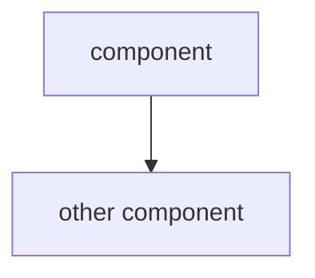

# {topic}

## Table of Contents
- [⚠️ Current Gaps](#️-current-gaps)
- [📚 Concepts](#-concepts)
  - [concept_one](#concept_one)
  - [concept_two](#concept_two)
- [🗒️ Notes](#️-notes)
- [🔗 Resources](#-resources)

---

## ⚠️ Current Gaps

> Inizia da qui. Questi sono i concetti aperti dalla tua ultima sessione.

| Concetto | Gap specifico |
|---|---|
| `concept_one` | descrizione precisa del gap |
| `concept_two` | descrizione precisa del gap |

---

## 📚 Concepts

### concept_one

> TL;DR — una riga che cattura l'essenza del concetto.

Spiegazione estesa. Diagramma mermaid solo se ci sono relazioni tra componenti.

---

### concept_two

> TL;DR — una riga.

Spiegazione. Tabella comparativa se il concetto si distingue da un altro.

| | option_a | option_b |
|---|---|---|
| Quando | ... | ... |
| Differenza | ... | ... |

---

## 🗒️ Notes

- nota libera

---

## 🔗 Resources

- [Title](url)
